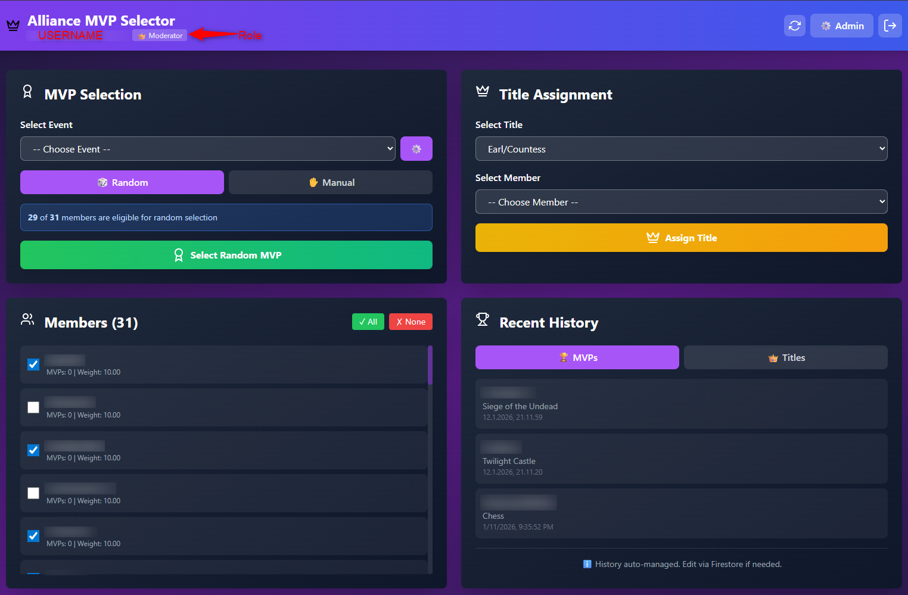
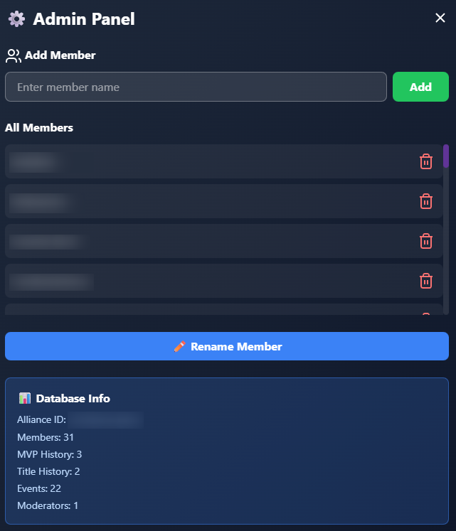
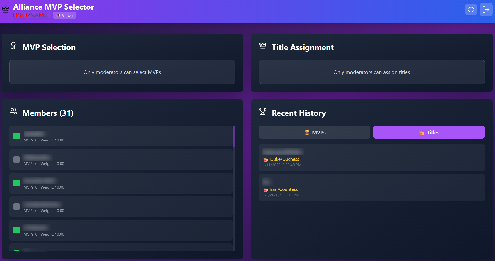

# 🏆 Alliance MVP Selector

A web-based application for managing alliance MVP (Most Valuable Player) selection and title assignments with real-time Firebase synchronization. Perfect for gaming alliances, guilds, or teams that need a fair and transparent system for selecting MVPs and assigning titles.


## ✨ Features

### Core Features
- 🎲 **Weighted Random MVP Selection** - Fair algorithm that reduces selection probability for recent MVPs
- ✋ **Manual MVP Selection** - Option for moderators to manually assign MVP
- ✅ **MVP Confirmation Prompts** - Verify eligibility with weight information before finalizing selection
- 👑 **Title Management** - Assign noble titles (Earl/Countess, Duke/Duchess, King/Queen) to members
- 🏷️ **Title Source Tracking** - Track whether titles were earned individually or given by alliance
- 👥 **Member Management** - Add, remove, and rename alliance members
- 📊 **History Tracking** - Complete history of all MVP selections and title assignments
- 🗑️ **Auto-Cleanup** - MVP history automatically maintained based on eligible player count
- 🔐 **Role-Based Access** - Moderators can modify data, viewers can only view
- 🔒 **Protected History** - History entries can only be modified through Firestore backend
- 🔄 **Real-time Sync** - All changes sync instantly across all users via Firebase
- 📱 **Cross-Platform** - Accessible and fully functional on PC, tablets, and smartphones
- 🎯 **Event-Based Selection** - Track MVPs by specific events (wars, battles, etc.)
- 🌐 **Cross-Server Support** - Mark events as cross-server with CS checkbox

## 📸 Screenshots

### Main Dashboard (Moderator Role)
The main interface showing MVP selection, title assignment, member list, and history.



### Admin Panel
Moderator interface for managing members, events, and viewing database information.



### Main Dashboard (Viewer Role)
The main interface showing member list, and history.



## 🚀 Quick Start (For End Users)

If someone has already set up the application and given you access:

1. Navigate to the deployed application URL
2. Log in with the credentials provided by your administrator
3. Start viewing MVP history and participating (if you're a moderator)

**That's it!** 🎉

## 🛠️ Setup Your Own Instance (For Developers/Admins)

Follow these steps to deploy your own instance of Alliance MVP Selector.

### Prerequisites

- [Google Account](https://accounts.google.com/signup)
- [Node.js](https://nodejs.org/) (optional, for local development)
- Basic knowledge of Firebase Console
- Web hosting (Firebase Hosting, Netlify, Vercel, GitHub Pages, etc.)

### Step 1: Clone the Repository

```bash
git clone https://github.com/YOUR-USERNAME/alliance-mvp-selector.git
cd alliance-mvp-selector
```

### Step 2: Create Firebase Project

1. Go to [Firebase Console](https://console.firebase.google.com/)
2. Click **Add project** (or select existing project)
3. Enter project name (e.g., "my-alliance-mvp")
4. Choose whether to enable Google Analytics (optional)
5. Click **Create project**
6. Wait for project creation to complete
7. Click **Continue**

### Step 3: Enable Firebase Authentication

1. In Firebase Console, click **Authentication** in the left sidebar
2. Click **Get Started**
3. Click the **Sign-in method** tab
4. Click **Email/Password**
5. Toggle **Enable** on
6. Click **Save**

### Step 4: Create Firestore Database

1. Click **Firestore Database** in the left sidebar
2. Click **Create database**
3. Select **Start in production mode**
4. Choose your Cloud Firestore location (pick closest to your users)
5. Click **Enable**
6. Wait for database creation to complete

### Step 5: Configure Firestore Security Rules

1. In Firestore Database, click the **Rules** tab
2. Delete the existing rules
3. Copy and paste the following rules:

```javascript
rules_version = '2';
service cloud.firestore {
  match /databases/{database}/documents {
    
    // Helper function to check if user is a moderator
    function isModerator(allianceId) {
      let moderatorsList = get(/databases/$(database)/documents/alliance/$(allianceId)/config/moderators).data.emails;
      return request.auth != null && request.auth.token.email in moderatorsList;
    }
    
    // Alliance configuration (moderator list) - only moderators can read/write
    match /alliance/{allianceId}/config/moderators {
      allow read: if request.auth != null;
      allow write: if isModerator(allianceId);
    }
    
    // Shared alliance data - everyone can read, only moderators can write
    match /alliance/{allianceId}/data/{document} {
      allow read: if request.auth != null;
      allow write: if isModerator(allianceId);
    }
    
    // Deny all other access
    match /{document=**} {
      allow read, write: if false;
    }
  }
}
```

4. Click **Publish**
5. Wait for "Rules published successfully" confirmation

### Step 6: Get Firebase Configuration

1. In Firebase Console, click the **⚙️ gear icon** next to "Project Overview"
2. Click **Project settings**
3. Scroll down to **Your apps** section
4. Click the **</>** (Web) icon to add a web app
5. Enter app nickname (e.g., "Alliance MVP Web")
6. **Do NOT** check "Also set up Firebase Hosting" (unless you want to use it)
7. Click **Register app**
8. Copy the `firebaseConfig` object shown

### Step 7: Update Application Configuration

1. Open `app.js` in your code editor
2. Find lines 2-9 (the `firebaseConfig` object)
3. Replace the entire `firebaseConfig` with your copied configuration:

```javascript
// REPLACE THIS ENTIRE SECTION WITH YOUR CONFIG
const firebaseConfig = {
    apiKey: "YOUR-API-KEY",
    authDomain: "YOUR-PROJECT.firebaseapp.com",
    projectId: "YOUR-PROJECT-ID",
    storageBucket: "YOUR-PROJECT.firebasestorage.app",
    messagingSenderId: "YOUR-SENDER-ID",
    appId: "YOUR-APP-ID"
};
```

4. (Optional) Change the alliance ID on line 62:
```javascript
const ALLIANCE_ID = 'alliance_main'; // Change to your alliance name
```

5. Save the file

### Step 8: Create First User Account

1. In Firebase Console, go to **Authentication** > **Users**
2. Click **Add user**
3. Enter email address (this will be your admin account)
4. Enter a strong password
5. Click **Add user**
6. **IMPORTANT**: Copy the exact email address (case-sensitive)

### Step 9: Initialize Database Structure

You have two options:

#### Option A: Automatic Setup (Recommended) ⭐

1. Deploy your application (see Step 10)
2. Open the app in your browser
3. Log in with the user you just created
4. The app will automatically create the database structure
5. You'll be set as the first moderator automatically
6. Done! 🎉

#### Option B: Manual Setup

1. In Firebase Console, go to **Firestore Database** > **Data**
2. Click **Start collection**
3. Collection ID: `alliance`
4. Document ID: `alliance_main` (or your custom alliance ID)
5. Click **Save** (leave fields empty for now)

6. Click on the `alliance_main` document
7. Click **Start collection**
8. Collection ID: `config`
9. Document ID: `moderators`
10. Click **Add field**:
    - Field name: `emails`
    - Field type: **array**
    - Click inside the array
    - Add string: YOUR EMAIL FROM STEP 8
11. Click **Save**

12. Go back to `alliance_main` document
13. Click **Start collection**
14. Collection ID: `data`
15. Document ID: `members`
16. Add field:
    - Field name: `list`
    - Field type: **array**
    - Leave empty
17. Click **Save**

18. Repeat steps 12-17 for these documents:
    - `mvpHistory` (with `list` array field)
    - `titleHistory` (with `list` array field)
    - `events` (with `list` array field)

### Step 10: Deploy the Application

Choose your preferred hosting method:

#### Option A: Firebase Hosting

```bash
# Install Firebase CLI globally
npm install -g firebase-tools

# Login to Firebase
firebase login

# Initialize Firebase Hosting
firebase init hosting

# When prompted:
# - Select your Firebase project
# - Public directory: . (current directory)
# - Single-page app: No
# - Overwrite index.html: No

# Deploy
firebase deploy --only hosting
```

Your app will be live at: `https://YOUR-PROJECT-ID.web.app`

#### Option B: Netlify

1. Create account at [Netlify](https://www.netlify.com/)
2. Drag and drop your project folder (containing index.html and app.js)
3. Your site is deployed! 🎉

#### Option C: Vercel

```bash
# Install Vercel CLI
npm install -g vercel

# Deploy
vercel
```

#### Option D: GitHub Pages (My Current Choice)

1. Create a new repository on GitHub
2. Push your code:
```bash
git init
git add .
git commit -m "Initial commit"
git branch -M main
git remote add origin https://github.com/YOUR-USERNAME/YOUR-REPO.git
git push -u origin main
```
3. Go to repository Settings > Pages
4. Select branch: `main`
5. Click Save
6. Your site will be live at: `https://YOUR-USERNAME.github.io/YOUR-REPO/`

#### Option E: Any Web Server

Simply upload `index.html` and `app.js` to any web server. Make sure both files are in the same directory.

### Step 11: Test Your Application

1. Open your deployed application URL
2. Log in with the credentials from Step 8
3. Verify you see:
   - ✅ Your email with "👑 Moderator" badge
   - ✅ Admin button in header
   - ✅ No error messages
   - ✅ Browser console (F12) shows "Data load complete"

**Congratulations! Your Alliance MVP Selector is now live!** 🎉

## 👥 Adding Users

### Adding Regular Users (Viewers)

1. Go to Firebase Console > Authentication > Users
2. Click **Add user**
3. Enter their email and password
4. Click **Add user**
5. Share credentials with the user
6. They can log in and view data (but not modify)

### Adding Moderators

Moderators can add members, select MVPs, assign titles, and modify data.

1. First, create their user account (see above)
2. Go to Firestore Database > Data
3. Navigate to: `alliance/alliance_main/config/moderators`
4. Click on the `emails` array field
5. Click **Add item**
6. Enter their **exact email address** (case-sensitive!)
7. Click **Update**
8. Have them log out and back in to see moderator access

## 📖 User Guide

### For Moderators

#### Selecting MVP

1. Click on the event dropdown and select the event type
2. (Optional) Check the "Cross-Server (CS)" box if this is a cross-server event
3. Choose selection mode:
   - **Random**: Weighted random selection (recent MVPs have lower probability)
   - **Manual**: Manually choose a specific member
4. If Random mode:
   - Ensure eligible members are selected (checkboxes)
   - Click "Select Random MVP"
   - **Review confirmation** showing member name, MVP count, and weight
   - Click OK to confirm or Cancel to abort
5. If Manual mode:
   - Select member from dropdown
   - Click "Assign MVP"
   - **Review confirmation** showing member stats
   - Click OK to confirm

#### Assigning Titles

1. Select title from dropdown (Earl/Countess, Duke/Duchess, King/Queen)
2. Select member from dropdown
3. Click "Assign Title"
4. **Choose title source**:
   - Click **OK** if earned individually
   - Click **Cancel** if given by alliance (adds "(ally)" suffix)
5. Confirm assignment

#### Managing Members

1. Click **Admin** button in header
2. In the admin panel:
   - **Add Member**: Enter name and click "Add"
   - **Remove Member**: Click trash icon next to member
   - **Rename Member**: Click "Rename Member" button

#### Managing Events

1. During MVP selection, click the ⚙️ icon next to event dropdown
2. Add new events or remove existing ones

#### Managing History

- **View**: All users can view MVP and title history
- **Edit/Delete**: Must be done through Firebase Console (Firestore Database)
- History automatically maintained (old MVP entries auto-removed based on eligible player count)

### For All Users

- View member list with MVP counts and weights
- See recent MVP history (last 10+ entries)
- See recent title history
- Toggle between MVP and Title history tabs

## 🏗️ Database Structure

```
alliance/
  └── alliance_main/              ← Your ALLIANCE_ID
      ├── config/
      │   └── moderators/
      │       └── emails: ["mod1@example.com", "mod2@example.com"]
      └── data/
          ├── members/
          │   └── list: [{name: "Player1", eligible: true}, ...]
          ├── mvpHistory/
          │   └── list: [{member: "Player1", event: "War", timestamp: "...", method: "weighted-random"}, ...]
          ├── titleHistory/
          │   └── list: [{member: "Player1", title: "Duke/Duchess (ally)", timestamp: "...", source: "alliance"}, ...]
          └── events/
              └── list: ["Bandit Attack", "Battle Royale", ...]
```

## 🎨 Customization

### Changing Alliance ID

Edit line 62 in `app.js`:
```javascript
const ALLIANCE_ID = 'your_custom_alliance_id';
```

Then create the corresponding structure in Firestore.

### Changing Titles

Edit the title dropdown in the `renderMainApp()` function around line 900:
```javascript
<option value="Earl/Countess">Earl/Countess</option>
<option value="Duke/Duchess">Duke/Duchess</option>
<option value="King/Queen">King/Queen</option>
// Add more titles here
```

### Changing Default Events

The app creates default events on first moderator login. Edit line 111 in `app.js`:
```javascript
state.events = ['Your Event 1', 'Your Event 2', 'Your Event 3'];
```

### Changing MVP Selection Algorithm

The weighted random algorithm is in the `calculatePenaltyWeight()` function (lines 180-184):
```javascript
function calculatePenaltyWeight(mvpCount) {
    if (mvpCount === 0) return defaultWeight;
    const calculatedPenalty = penaltyWeight * Math.pow(penaltyMultiplier, mvpCount);
    return Math.max(0.1, calculatedPenalty);
}
```

Adjust these constants (lines 57-59):
- `defaultWeight`: Base weight for members with no recent MVPs (default: 10)
- `penaltyWeight`: Starting penalty weight (default: 1)
- `penaltyMultiplier`: How much to reduce weight per MVP (default: 0.5 = 50% reduction)

### Styling

The app uses Tailwind CSS (loaded from CDN). To customize colors, edit the CSS variables in `index.html`:
```css
:root {
    --primary-gradient-start: #9333ea;
    --primary-gradient-end: #2563eb;
    --bg-gradient-start: #0f172a;
    --bg-gradient-mid: #581c87;
    --bg-gradient-end: #0f172a;
    --accent-green: #22c55e;
    --accent-red: #ef4444;
    --accent-blue: #3b82f6;
    --accent-purple: #a855f7;
    --accent-yellow: #fbbf24;
}
```

## 🔒 Security

- **Authentication Required**: All users must be authenticated to access any data
- **Role-Based Access**: Only moderators can modify data
- **Email Verification**: Moderator status verified via email match in Firestore
- **Firebase Security Rules**: Enforced at the database level
- **HTTPS**: Use HTTPS in production (Firebase Hosting provides this automatically)

### Security Best Practices

1. ✅ Use strong passwords for all accounts
2. ✅ Regularly review the moderator list
3. ✅ Remove users who should no longer have access
4. ✅ Monitor authentication logs in Firebase Console
5. ✅ Keep Firebase SDK updated
6. ✅ Never commit Firebase config to public repositories (if it contains sensitive data)
7. ✅ Use environment variables for sensitive data in production

## 🐛 Troubleshooting

### "Permission Denied" Error

**Cause**: Your email is not in the moderators list or security rules aren't published.

**Solution**:
1. Check Firestore: `alliance/alliance_main/config/moderators`
2. Verify your email is in the `emails` array (exact match, case-sensitive)
3. Verify security rules are published
4. Log out and back in

### "Document doesn't exist" Error

**Cause**: Database structure not initialized.

**Solution**:
1. Follow Step 9 (Manual Setup) to create all required documents
2. Or delete everything and let the app auto-create on first login

### Can't See Moderator Badge

**Cause**: Email doesn't match exactly or need to refresh.

**Solution**:
1. Log out and back in
2. Check email in Authentication matches email in moderators list exactly
3. Clear browser cache

### White Screen / No Content

**Cause**: Firebase config incorrect or files not loaded.

**Solution**:
1. Check browser console (F12) for errors
2. Verify Firebase config is correct in `app.js`
3. Ensure `index.html` and `app.js` are in the same directory
4. Hard refresh: Ctrl+Shift+R (Windows) or Cmd+Shift+R (Mac)

### More Troubleshooting

See `TROUBLESHOOTING.md` for comprehensive troubleshooting guide.

## 📊 Firebase Usage & Costs

This application uses Firebase's **free tier** (Spark Plan), which includes:

- **Authentication**: 50,000 free verifications/month
- **Firestore**: 50,000 reads, 20,000 writes, 20,000 deletes per day
- **Hosting**: 10 GB storage, 360 MB/day transfer
- **Storage**: 5 GB total

For a typical alliance of 50-100 members:
- Daily usage: ~100-500 reads, ~20-50 writes
- **Cost**: $0/month (well within free tier)

## 🤝 Contributing

Contributions are welcome! Here's how you can help:

1. Fork the repository
2. Create a feature branch (`git checkout -b feature/AmazingFeature`)
3. Commit your changes (`git commit -m 'Add some AmazingFeature'`)
4. Push to the branch (`git push origin feature/AmazingFeature`)
5. Open a Pull Request

### Development Setup

```bash
# Clone your fork
git clone https://github.com/YOUR-USERNAME/alliance-mvp-selector.git
cd alliance-mvp-selector

# No build process needed! Just edit the files and open index.html in a browser

# For local development with live reload, you can use any simple HTTP server:
# Option 1: Python
python -m http.server 8000

# Option 2: Node.js
npx http-server

# Option 3: VS Code extension
# Install "Live Server" extension and right-click index.html > "Open with Live Server"
```

## 📝 License

This project is licensed under the MIT License - see the [LICENSE](LICENSE) file for details.

## 🙏 Acknowledgments

- Built with [Firebase](https://firebase.google.com/)
- Styled with [Tailwind CSS](https://tailwindcss.com/)
- Icons from [Lucide](https://lucide.dev/)

## 📧 Support

- **Issues**: [GitHub Issues](https://github.com/YOUR-USERNAME/alliance-mvp-selector/issues)
- **Discussions**: [GitHub Discussions](https://github.com/YOUR-USERNAME/alliance-mvp-selector/discussions)

## 🗺️ Roadmap

Future features under consideration:
Let me know if you have suggestions. 

- [ ] Export data to CSV/Excel
- [ ] Import members from CSV
- [ ] Member statistics dashboard
- [ ] Multiple alliance support in single instance
      

## 📈 Version History

For detailed version history and changelog, see [CHANGELOG.md](CHANGELOG.md).

**Current Version**: 1.1.1

**Recent Updates** (v1.1.1):
- Cross-server (CS) checkbox for event tracking

**Previous Updates** (v1.1.0):
- MVP confirmation prompts with weight information
- Title source tracking (individual vs alliance-given)
- Automatic MVP history cleanup
- Updated title options (Earl/Countess, Duke/Duchess, King/Queen)
- Protected history (edit via Firestore only)

---

**Made with ❤️ for gaming alliances everywhere**

If you find this useful, please give it a ⭐ on GitHub!
